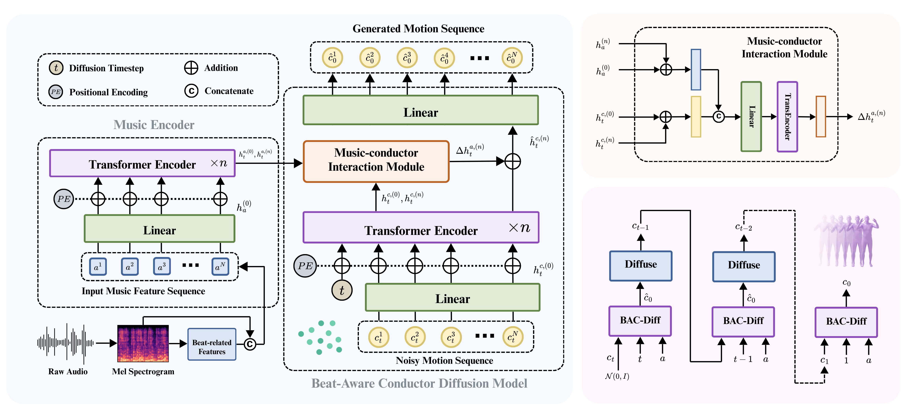
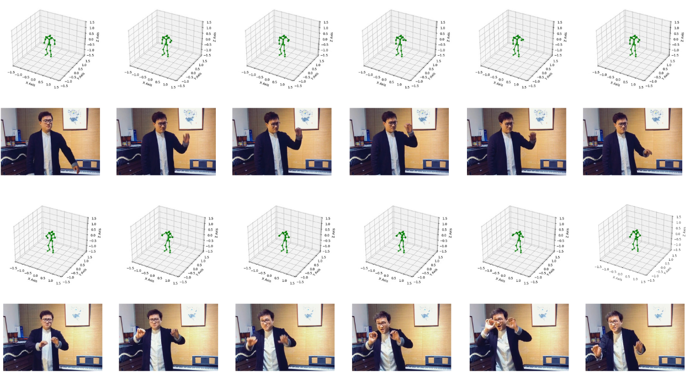

# 🎼 Beat-Aware Diffusion for Music-Driven Choral Conducting Motion Generation

- [Your Name] (Bournemouth University, NCCA)  
- Supervisor: Hammadi Nait-Charif

  
*Music-driven motion generation has seen growing interest, while conducting remains less explored. We study this task in the context of choral repertoire. Our method uses a phase-based beat cue that locates each frame within the current beat and a diffusion model conditioned on musical features to promote timing consistency and natural upper-body motion. Evaluations on held-out pieces indicate clearer beat alignment and plausible gestures compared with representative baselines.*  

---

## 📂 Dataset & Pretrained Models

### 1. Our Dataset  
We introduce a publicly available corpus for music-driven conducting motion with a focus on choral conducting. The dataset comprises approximately 21.9 hours of professionally recorded conductor performances spanning 663 distinct pieces.
Download all `.npy` files and place them into the `demo/` folder:  
🔗 [Google Drive Link](https://drive.google.com/drive/folders/1x-oST6VXu-AKbwYFuMaPwcB28GCe0rOg?usp=sharing)

 
---

### 2. Pretrained Weights  
Download the pretrained model (`.pth`) and put it in the `weight/` folder:  
🔗 [Google Drive Link](https://drive.google.com/file/d/1vTD9s6JJV9mT7WieeuiGyGrNK6AX0d4l/view?usp=sharing)

---

### 3. Body Models  

- **SMPL-H (male)** → place in `body_models/smplh/`  
  🔗 [Download Link](https://drive.google.com/file/d/1hMDRkFnSqTQTokeKdojEA38FbsvaQEQi/view?usp=sharing)

- **SMPL (neutral)** → place in `body_models/smpl/`  
  🔗 [Download Link](https://drive.google.com/file/d/1jp3ZquJxN9944JwAq9a7c00jbE12WKH0/view?usp=sharing)

---

## 📊 Quantitative Results  

We evaluate our method on the test set against two baselines (M²S-GAN and Zhao et al.).  
Metrics include **MSE** (lower is better), **FGD** (lower is better), **BC** (higher is better), and **Diversity** (higher is better).  
Values are reported as mean with 95% confidence intervals.  

| Methods    | MSE ↓            | FGD ↓            | BC ↑             | Diversity ↑       |
|------------|------------------|------------------|------------------|------------------|
| **Real**   | 0.000 ± 0.000    | 0.000 ± 0.000    | 0.842 ± 0.018    | 1.210 ± 0.036    |
| M²S-GAN    | 1.432 ± 0.095    | 0.921 ± 0.068    | 0.482 ± 0.030    | **1.083 ± 0.041** |
| Zhao et al.| 0.812 ± 0.052    | 0.643 ± 0.059    | 0.553 ± 0.027    | 0.963 ± 0.048    |
| **Ours**   | **0.588 ± 0.040**| **0.587 ± 0.051**| **0.616 ± 0.022**| 1.043 ± 0.044    |

---

## 🎥 Demo  

We provide demo videos showcasing music-driven conducting motion generated by our method:  
👉 [Watch Demo Video](https://drive.google.com/file/d/1mlAUcpSJHFO3OIr7eIaGYTZVlmoE3jMj/view?usp=sharing)

